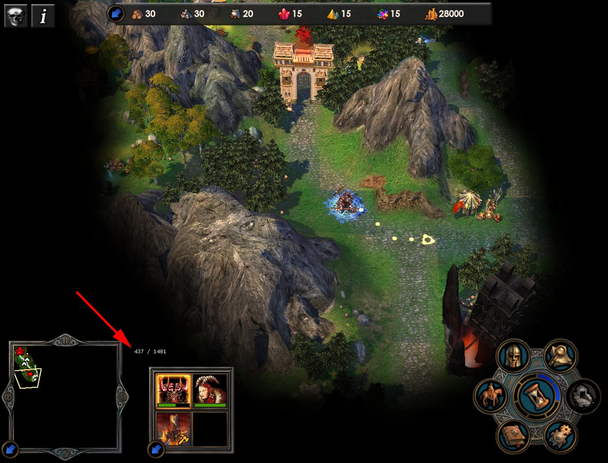

## DLL playground
 
Inject DLL to extend application functionality.

Display current move point in Heroes of Might and Magic 5 as number additionally to progress bar.


### Build

Cmake with flags `-G "Visual Studio 17 2022" -A Win32`

### Known limitations

Switching between fullscreen mode and window mode requires app restart.

### Run (MS-Detour tools)

Add dll to executable import table:
```powershell
setdll.exe /d:h5-extension.dll 'path-to-exe\H5_Game.exe'
```

Restore dll import table to original:
```powershell
setdll.exe /r 'path-to-exe\H5_Game.exe'
```

Run process with dll loaded at runtime:
```powershell
withdll.exe -d:.\cmake-build-release\src\Release\h5-extension.dll 'path-to-exe\H5_Game.exe'
```

### Acknowledgements

* MS Detours (general theory on C++ [Advise programming](https://en.wikipedia.org/wiki/Advice_(programming)), tooling to inject dlls, edit PE import table) https://github.com/microsoft/Detours
* Dear ImGui (dependency free GUI C++ library): https://github.com/ocornut/imgui
* Kiero (Graphical hook into DirectX, OpenGL, Vulkan engines): https://github.com/Rebzzel/kiero